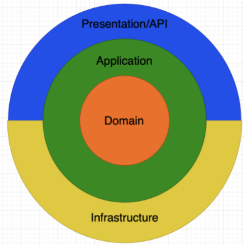
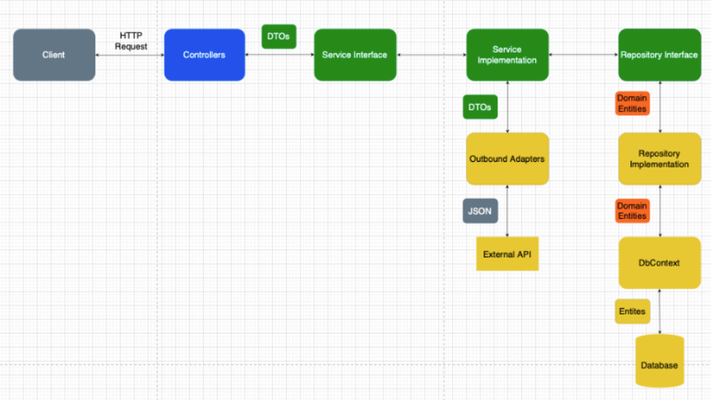

# Restaurant Sales Forecasting System

---

## Overview

This my capstone project i will be completing during the final year of my degree.

It is a full stack Angular & .NET web application powered by regression models to accurately forecast restaurant sales and surface insights to improve inventory & staffing decisions.

The machine learning layer consists of a Python service exposed using Flask, models are trained, tuned, tested, evaluated, and compared using time-aware splits. Historical data is augmented with engineered features for weather, to national holidays, internal events, external events and more.  

The main dashboard presents forecasting capabilities, alongside visualisations of trends, and forecasting history, all presented through a clean & user-friendly interface.

This repository will be updated accordingly. You can view the current progress of this project through a Kanban board and Gantt Chart held within the `Projects` tab.

---

## Technologies Used
- **Backend**: .NET 8, ASP.NET Core, EF Core, SQL Server 2022
- **Machine Learning**: Python (scikit-learn, pandas, numpy), Flask
- **Frontend**: Angular
- **Authentication**: Firebase JWT

---

## Architecture

This project follows Clean Architecture, enabling the clear separation of responsibilities and concerns between distince layers: 

### Diagram - Onion View & Component View

- Presentation/API Layer – Manages HTTP requests through controllers, mapping to DTOs and delegating business logic to necessary application services.
- Application Layer – Orchestrates the execution of tasks and use cases, handling interactions between the domain layer and external systems in the infrastructure layer.
- Domain Layer – The heart of the application, containing core business logic/rules & entities. 
- Infrastructure Layer – Manages external services & dependencies, details not core to the business logic of the application like repository implementations, persistence via EF Core, and external APIs.

**All dependencies point inward; outer layers depend on inner layers via interfaces (ports).**

---

## Contact

For any questions or feedback, feel free to reach out:

- **Email:** matty.tom@icloud.com
- **GitHub:** [Mattytomo365](https://github.com/Mattytomo365)

